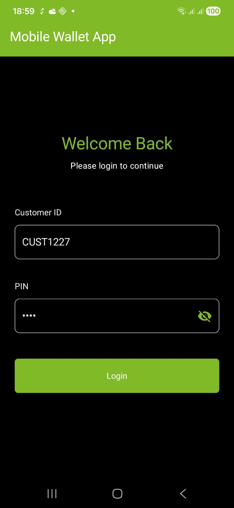
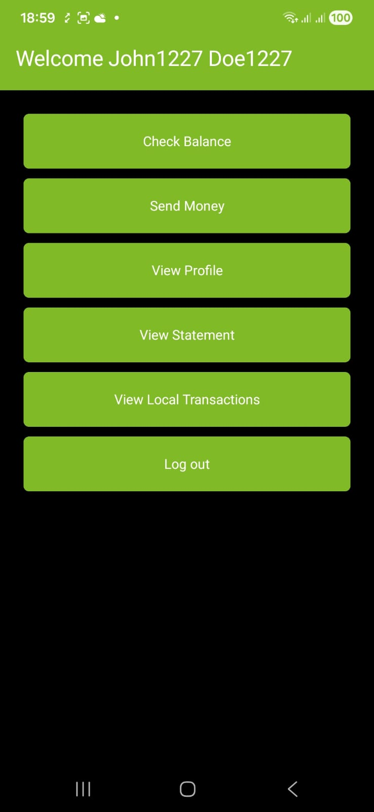
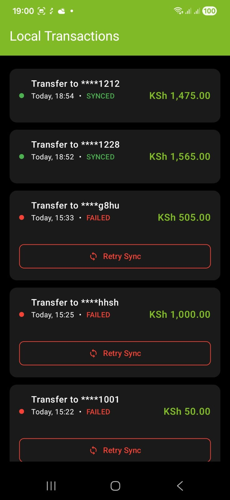
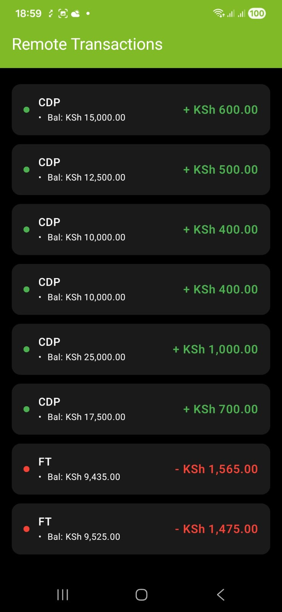
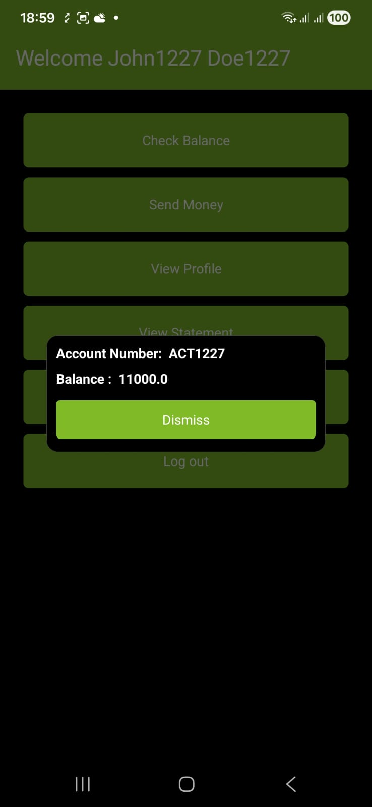

# Introductions

This is a simple mobile wallet app that consumes a spring boot API which enables customers to 
login, send money and view their recent Transactions. The app uses an offline first approach to cache 
the transactions before syncing them online. The app uses work manager to achieve this.


## Technologies Used
1. Jetpack Compose
2. Dagger Hilt for Dependency Injection
3. KTOR to make Api Calls
4. Datastore
5. Room Library for offline transactions.
6. MVVM architecture
7. Work Manager

## Screenshots of the app

  

  


## Running the Application Locally (Android App)

This Android application communicates with a locally running Spring Boot REST API.

### 1. Run the Spring Boot API Locally

Start the Spring Boot application using one of the following methods:

- From the terminal:
  mvn spring-boot:run
- Or run the main application class directly from your IDE.

Once started, the API will be available at:

http://localhost:8092

---

### 2. Update the Base URL in the Android App

Since the Android emulator or physical device cannot access localhost directly, the base URL must be updated in the Android project.

#### Android Emulator

Use the following base URL:

http://10.0.2.2:8092

#### Physical Device

Use your machine’s local IP address:

http://<your-local-ip>:8080

Example:

http://192.168.1.100:8092

---

### 3. Where to Update the Base URL

Locate the file where the API base URL is defined. This may be in:

- Constants.kt
- BuildConfig
- A network configuration module (Retrofit / Ktor / OkHttp)

Example:

```kotlin
const val BASE_URL = "http://10.0.2.2:8080"
```


